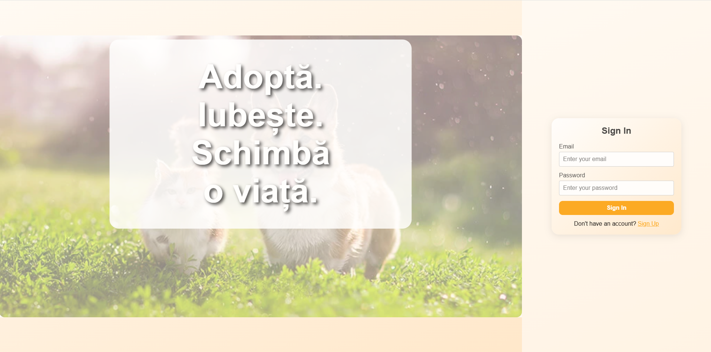
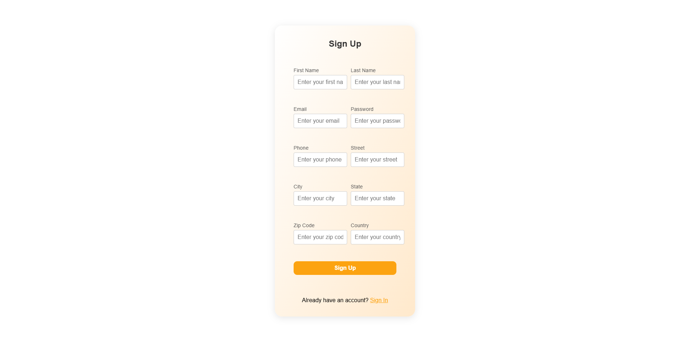
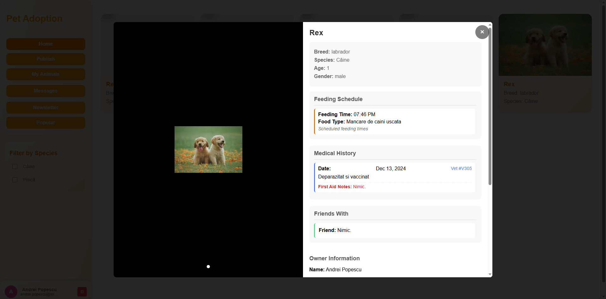
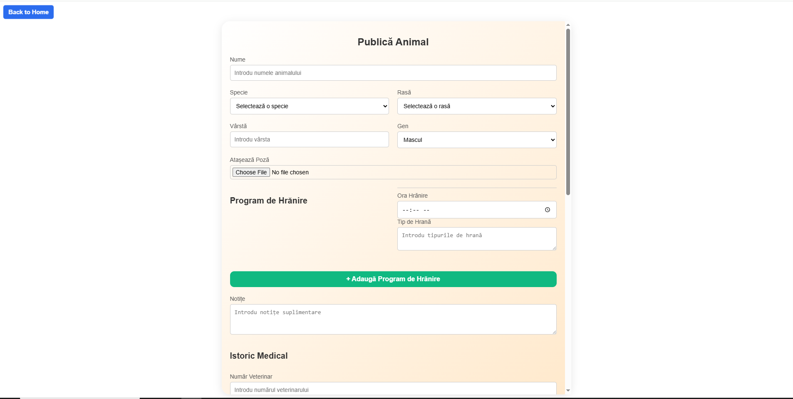
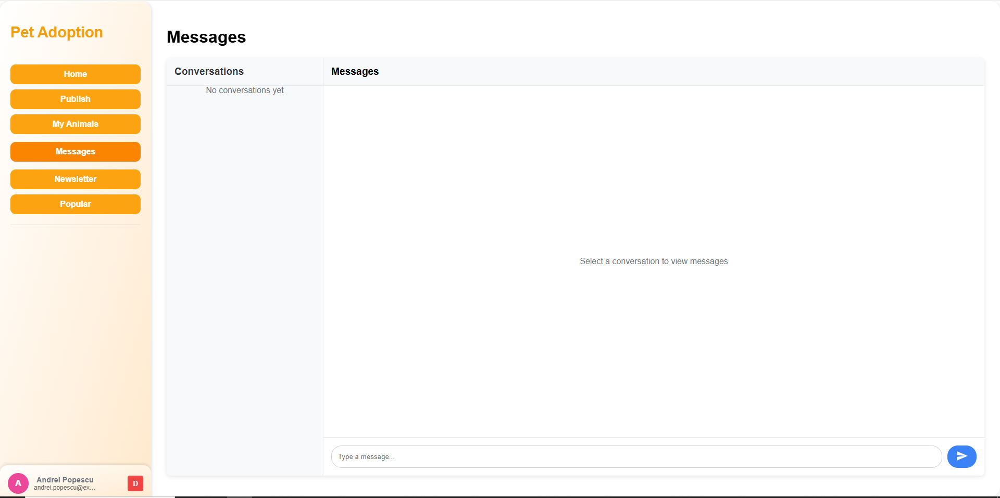
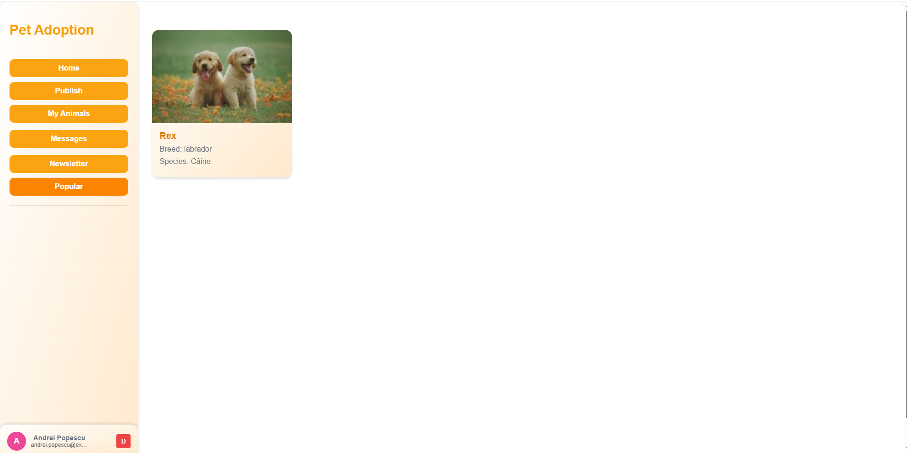
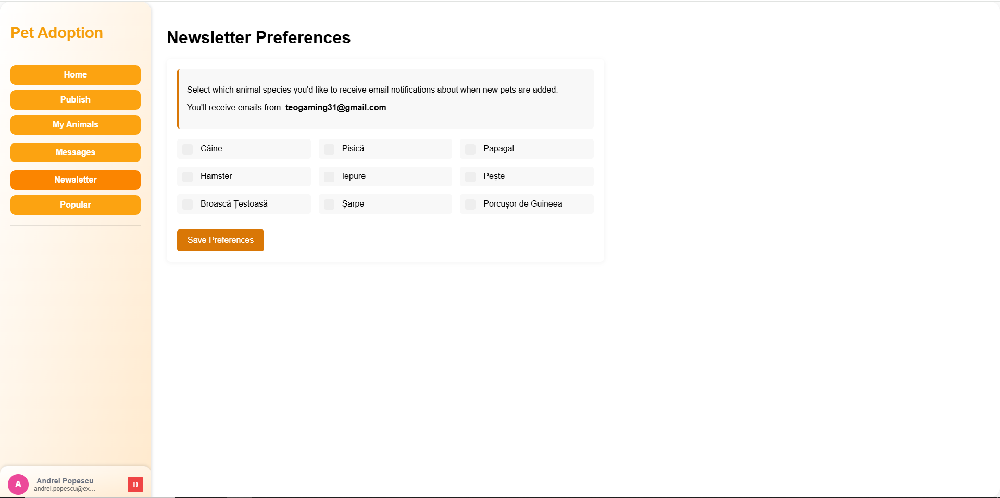
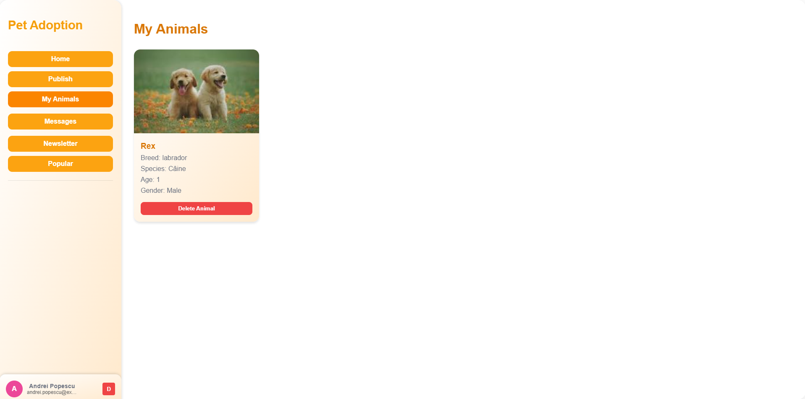

<div align="center">

  <h1>Platformă de Adopție Animale de Companie</h1>

  <p>
    O aplicație web care conectează familiile cu animale de companie disponibile pentru adopție.
  </p>

  <!-- Badges -->
  <p>
    
    
    
  </p>

</div>

<br/>

# :notebook_with_decorative_cover: Cuprins

- [Despre Proiect](#star2-despre-proiect)
  - [Capturi de Ecran](#camera-capturi-de-ecran)
  - [Demo Video](#movie_camera-demo-video)
  - [Tehnologii Utilizate](#space_invader-tehnologii-utilizate)
  - [Funcționalități](#dart-funcționalități)
  - [Referință Culori](#art-referință-culori)
  - [Variabile de Mediu](#key-variabile-de-mediu)
- [Primii Pași](#toolbox-primii-pași)
  - [Cerințe Preliminare](#bangbang-cerințe-preliminare)
  - [Instalare](#gear-instalare)
  - [Rulare Locală](#running-rulare-locală)
  - [Implementare](#triangular_flag_on_post-implementare)
- [Utilizare](#eyes-utilizare)
- [Plan de Dezvoltare](#compass-plan-de-dezvoltare)
- [Întrebări Frecvente](#grey_question-întrebări-frecvente)
- [Licență](#warning-licență)
- [Contact](#handshake-contact)
- [Mulțumiri](#gem-mulțumiri)

---

## :star2: Despre Proiect

Platforma de Adopție a Animalelor de Companie este o aplicație web care permite utilizatorilor autentificați să publice anunțuri pentru animale disponibile pentru adopție sau să adopte animale de companie. Sistemul oferă funcționalități complete pentru gestionarea resurselor privitoare la îngrijirea animalelor, precum și facilitarea procesului de adopție.

### :camera: Capturi de Ecran

<div align="center"> 
  
  <p>Pagina de start a aplicației</p>

  
  <p>Pagina de înregistrare utilizatori</p>

  
  <p>Profil animal disponibil pentru adopție</p>
  
  
  <p>Formular pentru publicarea animalelor</p>
  
  
  <p>Sistem de mesagerie între utilizatori</p>
  
  
  <p>Afișare animale populare</p>
  
  
  <p>Sistem de newsletter și notificări</p>
  
  
  <p>Gestionarea animalelor publicate de utilizator</p>
</div>

### :movie_camera: Demo Video
<div align="center">
  <a href="https://youtu.be/c3CDLODhjsk" target="_blank">
    <br/>
    <strong>Urmărește demo-ul aplicației pe YouTube</strong>
  </a>
</div>


---

### :space_invader: Tehnologii Utilizate

<details>
  <summary>Client</summary>
  <ul>
    <li>HTML5</li>
    <li>CSS3</li>
    <li>JavaScript</li>
  </ul>
</details>

<details>
  <summary>Server</summary>
  <ul>
    <li>Java 21</li>
    <li>Spring Boot 3.5.0</li>
    <li>Spring Security</li>
    <li>Spring Data JPA</li>
    <li>Maven</li>
    <li>JWT (JSON Web Tokens)</li>
    <li>Swagger/OpenAPI</li>
  </ul>
</details>

<details>
  <summary>Bază de Date</summary>
  <ul>
    <li>Oracle Database</li>
    <li>Hibernate ORM</li>
  </ul>
</details>

---

### :dart: Funcționalități

- Autentificare și Înregistrare cu JWT
- Publicare Anunțuri Adopție
- Profil Animal
- Calendar Hrănire
- Istoric Medical
- Încărcare Multimedia
- Filtrare și Căutare
- Newsletter
- Administrare
- Flux RSS
- API REST cu documentație Swagger

---

### :art: Referință Culori

| Tip               | Hex                                                              |
|-------------------|------------------------------------------------------------------|
| Culoare Primară   |  #fca311 |
| Culoare Secundară |  #14213d |
| Accent            |  #e5e5e5 |
| Text              |  #000000 |

---

### :key: Variabile de Mediu

Pentru backend-ul Java, creați un fișier `.env` sau configurați variabilele de sistem:

```env
USER_DATABASE=your_oracle_username
PASSWORD_DATABASE=your_oracle_password
JWT_SECRET=your_jwt_secret_key
EMAIL_ADDRESS=your_email@gmail.com
EMAIL_PASSWORD=your_email_app_password
```

---

## :toolbox: Primii Pași

### :bangbang: Cerințe Preliminare

- Java Development Kit (JDK) 21+
- Maven 3.6+
- Oracle Database
- Oracle Instant Client

```bash
java -version
mvn -version
```

---

### :gear: Instalare

```bash
git clone https://github.com/Florea123/Pet-Adoption-on-Web.git
cd Pet-Adoption-on-Web
```

Instalați dependențele backend:

```bash
cd backend/backend-java
mvn clean install
```

---

### :running: Rulare Locală

1. Configurați baza de date:
   - Importați `ScriptCreareTabele.txt` și `ScriptPopulare.txt` în Oracle.

2. Configurați variabilele de mediu în `application.properties` sau creați un fișier `.env`.

3. Porniți serverul Spring Boot:

```bash
cd backend/backend-java
mvn spring-boot:run
```

Sau utilizați JAR-ul compilat:

```bash
java -jar target/pet-adoption-api-0.0.1-SNAPSHOT.jar
```

4. Deschideți în browser:

```
http://localhost:3000/frontend/Home/Home.html
```

5. Pentru documentația API:

```
http://localhost:3000/swagger-ui.html
```

---

### :triangular_flag_on_post: Implementare

Pentru implementarea în producție:

```bash
# Compilare pentru producție
mvn clean package -DskipTests

# Rulare cu profil de producție
java -jar -Dspring.profiles.active=prod target/pet-adoption-api-0.0.1-SNAPSHOT.jar
```

---

## :eyes: Utilizare

### API Endpoints

Aplicația oferă următoarele endpoint-uri principale:

- `POST /api/auth/login` - Autentificare utilizator
- `POST /api/auth/register` - Înregistrare utilizator nou
- `GET /api/animals` - Listarea animalelor disponibile
- `POST /api/animals` - Publicare animal nou
- `GET /api/animals/{id}` - Detalii animal
- `PUT /api/animals/{id}` - Actualizare animal
- `DELETE /api/animals/{id}` - Ștergere animal

### Exemplu utilizare API:

```javascript
// Autentificare
const loginResponse = await fetch('/api/auth/login', {
  method: 'POST',
  headers: { 'Content-Type': 'application/json' },
  body: JSON.stringify({
    username: 'username',
    password: 'password'
  })
});

const { token } = await loginResponse.json();

// Publicare animal
const animalData = {
  name: "Rex",
  species: "Câine",
  breed: "Labrador",
  age: 2,
  gender: "MALE"
};

await fetch('/api/animals', {
  method: 'POST',
  headers: { 
    'Content-Type': 'application/json',
    'Authorization': `Bearer ${token}`
  },
  body: JSON.stringify(animalData)
});
```

---

## :compass: Plan de Dezvoltare

- [x] Migrare la Spring Boot
- [x] Autentificare utilizatori cu JWT
- [x] CRUD pentru animale cu API REST
- [x] Încărcare și gestionare resurse multimedia  
- [x] Istoric medical și calendar hrănire  
- [x] Sistem de mesagerie între utilizatori  
- [x] Implementare flux RSS  
- [x] Documentație API cu Swagger
- [ ] Aplicație mobilă  
- [ ] Notificări push
- [ ] Integrare cu servicii de plăți

---


## :grey_question: Întrebări Frecvente

**Cum pot adopta un animal?**  
Autentifică-te prin API-ul `/api/auth/login` și contactează proprietarul unui animal disponibil.

**Pot publica mai multe animale?**  
Da, poți utiliza endpoint-ul `/api/animals` pentru a publica câte animale dorești.

**Unde pot găsi documentația API?**  
Documentația completă este disponibilă la `http://localhost:3000/swagger-ui.html` când serverul rulează.

---

## :warning: Licență

Distribuit sub licența MIT. Vezi fișierul `LICENSE`.

---

## :handshake: Contact

**Florea Robert-Andrei** și **Sandu Theodor** 

**Proiect**: [https://github.com/Florea123/Pet-Adoption-on-Web.git](https://github.com/username/Pet-Adoption-on-Web)

---

## :gem: Mulțumiri

- [Spring Boot](https://spring.io/projects/spring-boot)
- [Oracle Database](https://www.oracle.com/database/)
- [JWT](https://jwt.io/)
- [Swagger](https://swagger.io/)
- [Maven](https://maven.apache.org/)
- [Shields.io](https://shields.io/)
